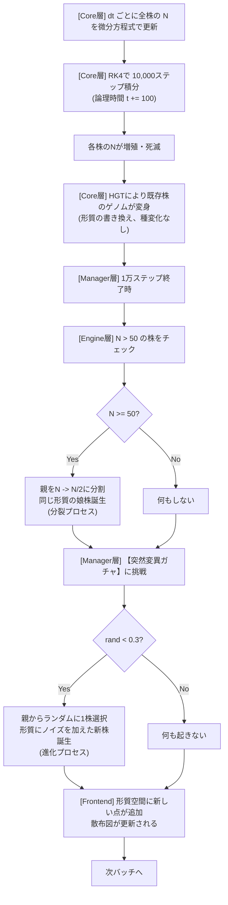

# 🧬 引継ぎ資料：「分裂」の定義と二重構造

## 概要

このシミュレータにおいて、**「分裂」という言葉は2つの異なるレイヤーを指しています**。この区別を正確に理解することが、コード保守と拡張の鍵になります。

> **一言で言うと**：このシミュレータは、**『数としての増加（確定的）』と『種としての分岐（確率的）』**のハイブリッドです。

---

## 1. 連続的な増殖（個体数Nの自然増加）

### 物理的意味
細菌がエサを食べて新しい細胞として分裂し、**個体数が増える現象そのもの**。

### 実装場所
- **[core.py](../backend/core.py) の `f_system()` 関数**
- **[core.py](../backend/core.py) の `compute_batch_kernel()` 関数内のRK4ループ**

### 計算手法
微分方程式による数値積分：

$$\frac{dN_i}{dt} = \left[ g_i(S, Temp, pH) - m_i - d_{tox,i} - d_{rad,i} \right] N_i$$

ここで：
- $g_i$：増殖速度（栄養、温度、pH依存）
- $m_i$：維持コスト（能力に応じたペナルティ）
- $d_{tox,i}$：毒素ストレスによる死滅
- $d_{rad,i}$：放射線ストレスによる死滅

### 時間的な性質
- **確定的**：同じ初期条件・環境なら同じ結果になる（乱数使わない）
- **連続的**：毎タイムステップ（dt=0.01）で滑らかに発展
- **族群レベル**：個体1つ1つではなく、株全体の「量」として計算

### 引継ぎポイント
ここでは**新しい株（Strain ID）は生まれません**。あくまで「株ID #5 の個体数が 100 から 150 に増えた」という**「量」の変化**として処理されます。

**コード例**：
```python
# core.py の f_system() で毎ステップ計算
dN = (g - m_costs - d_tox - d_rad) * N  # 各株の量の変化率

# compute_batch_kernel() で RK4 積分
N = N + (dt/6) * (k1 + 2*k2 + 2*k3 + k4)  # 数値更新
```

---

## 2. 離散的な新系統の誕生

### 2a. 成長による分裂（Binary Fission）

#### 物理的意味
族群が大きく成長したとき、計算上の効率性を保つため、**単一の株を「分割」して2つの独立した系統を作る**処理。実装上、生物学的な分裂に相当します。

#### 実装場所
**[engine.py](../backend/engine.py) の `division_trigger()` メソッド**

#### メカニズム
各バッチ（1万ステップ）終了時、以下の処理を実行：

1. 全活動株をチェック
2. $N_i \geq 50$ の株について
3. 親の個体数を $N_i \rightarrow N_i / 2$ に減分
4. 親と**同じ形質の娘株**を1つ誕生させる
5. 空きスロット（free_indices）から新しい配列インデックスを割り当て

#### 時間的な性質
- **確定的**：N > 50なら必ず分裂する
- **離散的**：1万ステップ単位で判定（毎ステップではない）
- **メモリ効率**：コピーアンドペースト方式で、前回の絶滅スロットを再利用

#### 引継ぎポイント
- 新しい形質は生まれない（親と同じゲノムをコピー）
- あくまで「個体群のサイズ制御」の役割
- 形質の多様性は突然変異で担当

**コード例**：
```python
# engine.py の division_trigger()
def division_trigger(self, threshold=50.0):
    for idx in active_idx:
        self.N[idx] /= 2.0  # 親を分割
        self.spawn(parent_idx=idx)  # 同じ形質の娘株誕生
```

### 2b. 突然変異による新系統誕生

#### 物理的意味
**分裂の際に、ごく稀にDNAコピーエラーが起き、親とは異なる形質を持った新しい系統が誕生する**現象。これが「進化」を駆動します。

#### 実装場所
**[manager.py](../backend/manager.py) の `run_loop()` メソッド内**（各バッチ後）

#### メカニズム
1. **判定タイミング**：1万ステップごと（毎ステップではない）
2. **発生確率**：`if np.random.rand() < 0.3` → 30%の確率で実行
3. **親の選択**：生存中の株からランダムに1つ選ぶ
4. **形質の生成**：
   - 親の traits をコピー
   - $\mathcal{N}(0, 0.03)$ の正規分布ノイズを加える
   - 形質を有効範囲内にクリップ
5. **新株の登録**：free_indices から空きスロットに割り当て

#### 時系列の性質
- **確率的**：乱数に支配される
- **離散的**：1万ステップ単位で判定
- **進化デバイス**：形質空間に新しい「点」が追加される最も重要なメカニズム

#### 引継ぎポイント
この処理が、散布図（x=μ_max, y=K_s）に新しい点として映ります。

**コード例**：
```python
# manager.py の run_loop()
if np.random.rand() < 0.3:  # バッチごと30%
    parent_idx = np.random.choice(active)
    self.engine.spawn(parent_idx=parent_idx)  # spawn() が自動的に突然変異を加える

# engine.py の spawn() 内
if not initial:
    new_traits = self.traits[parent_idx].copy()
    new_traits += np.random.normal(0, 0.03, 7)  # 突然変異ノイズ
```

---

## 3. なぜ「毎ステップ判定」をしないのか？（重要）

引継ぎ人が「なぜ分裂・新株発生をもっと細かく判定しないのか？」と疑問に持ったとき、以下の情報工学的な制約を説明してください。

### メモリのパンク
1ステップ（dt=0.01）ごとに新種が生まれる判定をすると、次の問題が発生します：

- 配列サイズ：max_strains = 100,000
- シミュレーション実行時間：100,000ステップ = 1000論理時間単位
- 毎ステップ新株1個生成：100,000 × 1,000 = **1億個の新株候補**
- メモリ結果：数秒で100,000スロットが埋まり、シミュレーション停止

### 計算の不毛さ
新株のほとんどは、親とほぼ同じ形質です：

- 親：μ_max = 1.2
- 新株（ノイズ後）：μ_max = 1.2 + 0.03 × 乱数 ≈ 1.2

この微小な差は、ほぼ即座に環境競争で淘汰されます。

**結論**：1万ステップに1回程度に絞ることで、**「有意な差を持った系統」だけを効率的にサンプリング**しています。

### 計算資源の集中
細菌シミュレータの設計フィロソフィ：

| アプローチ | 実装 | 計算量 |
|-----------|------|--------|
| **Agent-based** | 細胞1つ1つを個別追跡 | 次数：個体数 × ステップ数 |
| **Population-based** ✅ | 群（株）として偏微分方程式で処理 | 次数：株数 × ステップ数（桁違いに低い） |

**このシミュレータ**は Population-based アプローチを採用しており、**群全体をまとめて計算**することで、**1億ステップという極限の規模**が可能になっています。

---

## 4. 引継ぎ用：分裂ロジックのフローチャート



---

## 5. コード実装での使い分け

### ケース1：「株の個体数を増やしたい」
→ **f_system() の g（増殖速度）を増やす**
```python
# core.py
def get_growth_rate(S, mu_max, Ks, temp, t_opt, ph, ph_opt):
    base_growth = mu_max * (S / (Ks + S))  # ← µ_max を増やす
```

### ケース2：「新しい形質を持つ株を意図的に追加したい」
→ **engine.spawn(parent_idx=..., initial=True) を呼び出し**
```python
# engine.py
new_idx = engine.spawn(initial=True)  # 初期形質で新株誕生
```

### ケース3：「分裂の閾値を変更したい」
→ **engine.division_trigger(threshold=...) の閾値を調整**
```python
# manager.py の run_loop()
engine.division_trigger(threshold=100.0)  # デフォルト50から100に変更
```

### ケース4：「突然変異の発生確率を変更したい」
→ **manager.run_loop() の確率 0.3 を変更**
```python
# manager.py
if np.random.rand() < 0.5:  # 30% → 50%に変更
    self.engine.spawn(parent_idx=...)
```

---

## 6. まとめ：引継ぎ人への一言

> **「このシミュレータにおいて、分裂は『数としての増加（確定的）』と『種としての分岐（確率的）』のハイブリッドです。**
>
> **core.py は個体群全体のダイナミクスを管理し、**
> **engine.py と manager.py は離散的な進化イベント（分裂・突然変異）を管理します。**
>
> **コードをいじる時は、個体数を増やしたいのか、新しい種を登場させたいのか、意識してください。」**

---

## 参考資料

| ファイル | 役割 | 関連函数 |
|---------|------|--------|
| [core.py](../backend/core.py) | 連続的な増殖（計算カーネル） | `f_system()`, `compute_batch_kernel()` |
| [engine.py](../backend/engine.py) | 分裂イベント + メモリ管理 | `division_trigger()`, `spawn()`, `reap()` |
| [manager.py](../backend/manager.py) | 突然変異ガチャ + 統合制御 | `run_loop()`, `run_hgt_events()` |
| [main.py](../backend/main.py) | 通信層（FastAPI/WebSocket） | （変更不要） |

---

**最終更新**: 2026年3月5日
